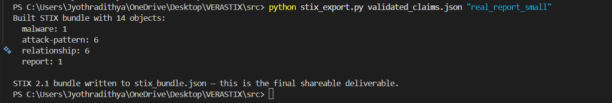
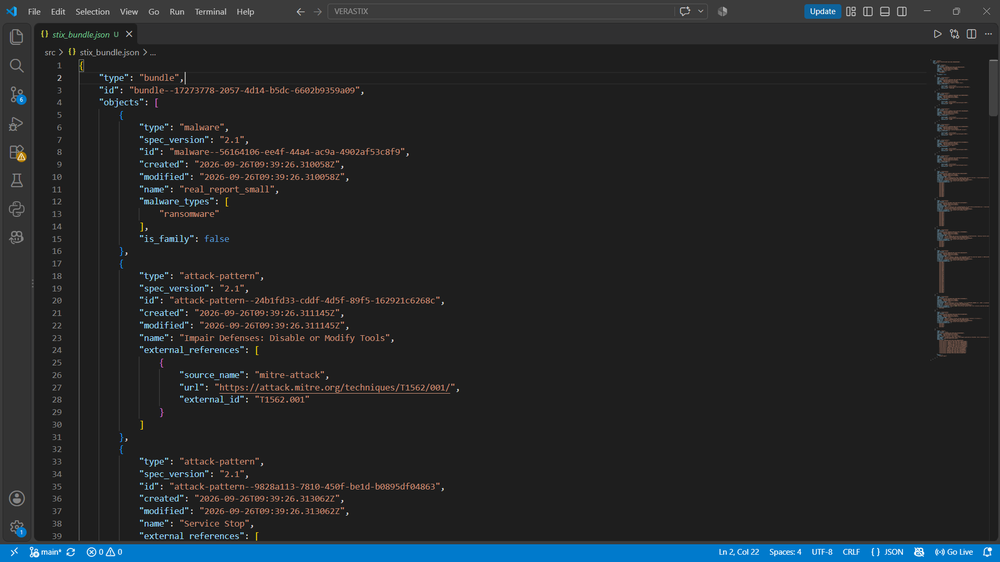

# VeraSTIX
**Evidence-Grounded Sandbox-to-STIX Pipeline**

VeraSTIX converts raw malware sandbox reports (CAPEv2 JSON) into shareable, standards-compliant STIX 2.1 threat intelligence — where every claim about what a piece of malware did is required to cite the specific raw evidence that supports it.

"Vera" — Latin for true — because every relationship in the output is verifiable, not just asserted.

---

## The problem this addresses

Sandbox reports are huge, noisy, and mostly benign background noise. Turning them into clean threat intelligence usually means either:

- Manual analysis — accurate, but slow and doesn't scale
- Naive LLM summarization — fast, but unreliable. A recent USENIX Security-track paper (arXiv 2609.01174, "A SoK for SoCs: Reading the TI Leaves on AI for Cyber Threat Intelligence Generation and Sharing") benchmarked exactly this: feeding a raw sandbox report to an LLM and asking it to produce STIX output achieved only 25–31% indicator recall, and up to 46% of the AI-asserted relationships had no supporting evidence at all.

That paper explicitly names three open research directions: (1) decomposed, self-validating workflows instead of single-shot generation, (2) full-pipeline benchmarks, and (3) explicit redaction policy. VeraSTIX is a small, concrete attempt at all three.

## What VeraSTIX actually does

```text
Raw CAPEv2 report (JSON)

        │
        ▼

 ┌─────────────┐   Flattens the nested report into atomic,
 │ 1. Extract  │   individually-addressable "evidence records"
 └─────────────┘   (evidence_id + source_path for every fact)

        │
        ▼
 ┌─────────────┐   Rule-based ATT&CK technique detection.
 │ 2. Enrich   │   Every claim lists the exact evidence_ids
 └─────────────┘   that justify it — nothing is asserted freely.

        │
        ▼
 ┌─────────────┐   Mechanically verifies every claim:
 │ 3. Validate │   do the cited evidence_ids exist? Are they a
 └─────────────┘   plausible evidence type for this claim?

        │
        ▼
 ┌─────────────┐   Strips victim-identifying data (usernames,
 │ 4. Redact   │   hostnames, internal IPs) with a consistent,
 └─────────────┘   auditable placeholder scheme.

        │
        ▼
 ┌─────────────┐   Serializes validated + redacted claims into
 │ 5. Package  │   a real STIX 2.1 Bundle. Evidence IDs survive
 └─────────────┘   into the output as custom properties.

        │
        ▼
   stix_bundle.json — shareable, cited, redacted CTI
```

The evidence citation isn't cosmetic — it's mechanically enforced at two separate points (the Validator, and again as inspectable data in the final STIX output), and it's checkable by anyone who opens the bundle.

---

## VeraSTIX in Action

VeraSTIX processes a raw CAPEv2 sandbox report through a fully traceable pipeline:

```text
Raw CAPEv2 JSON
      ↓
Evidence Extraction
      ↓
ATT&CK Enrichment
      ↓
Evidence Validation
      ↓
Privacy Redaction
      ↓
STIX 2.1 Packaging
```

### Pipeline execution

The complete pipeline produced **761 evidence records**, generated **6 ATT&CK technique claims**, validated **6 claims: 5 valid, 1 warning, 0 rejected**, redacted **9 fields**, and produced a STIX 2.1 bundle containing **14 objects**.



### Generated STIX 2.1 bundle

The final output is a standards-compliant STIX 2.1 Bundle containing malware, ATT&CK attack-pattern objects, relationships, and MITRE ATT&CK external references.



---

## Benchmark results

Tested against 8 real malware samples (CAPEv2 reports from the Thcrull/win-exe-malware-analysis dataset), comparing VeraSTIX's independently-derived, cited claims against CAPE's own automated `ttps` field:

| Metric | Paper's naive LLM baseline | VeraSTIX (this project) |
|---|---|---|
| Recall | 25–31% | **41.3%** average (33.3–50% per sample) |
| Unsupported claims | up to 46% | **0%** |

Read this honestly, not as a headline win:

- Recall here is measured against CAPE's own automated tagging, not independent human-verified ground truth — a narrower, more modest claim than what the paper's baseline was likely measured against.
- This benchmark is in-sample: the detection rules were iteratively developed and tuned against these same 8 reports. A held-out test set would likely show a lower, more representative number. This has not yet been done.
- A few rules (native API usage, generic file-attribute changes) are deliberately low-specificity and are marked as such — the STIX output carries a `confidence` field on every relationship so this isn't hidden.
- Some CAPE-claimed techniques (confirmed in at least one sample) appear to come from static analysis rather than the observed dynamic execution, and are structurally impossible to verify from sandbox behavior logs alone — this is a real scope boundary of any dynamic-analysis-only pipeline, VeraSTIX included.

The one number that is robust regardless of sample size: **0% unsupported claims, by construction**, because every claim is rule-generated with evidence attached rather than freely asserted.

---

## How this compares to existing tools

VeraSTIX is intentionally narrower than full-featured malware-analysis and CTI platforms.

| Capability | VeraSTIX | Typical sandbox / CTI workflow |
|---|---|---|
| Raw sandbox analysis | Uses existing CAPEv2 reports | Usually provided by sandbox |
| Evidence extraction | Yes | Varies |
| ATT&CK enrichment | Rule-based | Often automated |
| Evidence-backed claims | **Required** | Not always enforced |
| Mechanical validation | **Yes** | Varies |
| Privacy redaction | **Yes** | Varies |
| STIX 2.1 export | **Yes** | Common in CTI platforms |
| Evidence traceability | **Core design goal** | Often requires manual investigation |

VeraSTIX is not intended to replace CAPEv2 or a full CTI platform. Instead, it focuses on the transformation layer between sandbox telemetry and shareable, evidence-grounded intelligence.

---

## Project structure

```text
VeraSTIX/
│
├── data/
│   └── raw_reports/
│       └── <CAPEv2 reports>
│
├── docs/
│   ├── pipeline-output.png
│   └── stix-output.png
│
├── output/
│
├── src/
│   ├── extract_v2.py
│   ├── enrich.py
│   ├── validate.py
│   ├── redact.py
│   ├── stix_export.py
│   ├── benchmark.py
│   ├── claims.json
│   ├── validated_claims.json
│   └── stix_bundle.json
│
├── .gitignore
├── LICENSE
├── README.md
└── requirements.txt
```

---

## Running it

Install the project dependency:

```bash
pip install -r requirements.txt
```

Then run the pipeline:

```bash
cd src

python extract_v2.py ../data/raw_reports/<report>.json

python enrich.py

python validate.py evidence_real.json claims.json

python redact.py

python stix_export.py validated_claims.json "<sample_name>"
```

Or run the benchmark:

```bash
python benchmark.py
```

The generated STIX bundle will be written to:

```text
src/stix_bundle.json
```

### Important

The generated evidence and redaction artifacts may contain sensitive sandbox telemetry. Local-only files such as the redaction manifest should **not** be shared publicly.

---

## Limitations & honest future work

VeraSTIX is a focused research/engineering prototype rather than a complete CTI production platform.

Current limitations include:

- ATT&CK detection is rule-based rather than learned.
- Dynamic sandbox behavior cannot verify every technique that may be identified through static analysis.
- Some behavioral indicators are inherently low-specificity and therefore receive lower confidence.
- The current benchmark is small and in-sample.
- CAPE's automated ATT&CK tagging is used as the benchmark reference rather than independently verified human ground truth.
- The pipeline currently focuses on CAPEv2 JSON reports.
- A larger held-out evaluation set is needed to measure generalization.

Future work could include:

- Larger and held-out benchmark datasets
- Additional sandbox formats
- More precise ATT&CK detection rules
- Analyst feedback loops
- STIX Indicator and Observed Data generation
- Integration with TAXII servers
- SOC/SIEM ingestion
- Automated CTI sharing workflows

---

## Background reading

The project was motivated by recent research into automated threat-intelligence generation and the reliability of AI-generated CTI.

The key design principle is that generated intelligence should remain traceable to the underlying evidence instead of relying solely on unconstrained text generation.

---

## Author

**Adithya**  
B.Tech Computer Science & Engineering (Cybersecurity)  
IIIT Kottayam
